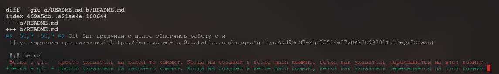

# Гайд по git

## Вступление
Если вы пользуетесь VSCode, большая часть всего этого контрится встроенным Source Control. Такая же секретная фича есть и в PyCharm. По итогу в целом работы с консольным git можно во многом избежать, но лучше все равно его знать.

## Инициализация репозитория

### Инициализация с нуля

#### Создание пустого локального репозитория в текущей папке:
```
git init
``` 
После этого в текущей директории появится папка .git - главная папка, в которой хранится вся информация git. ВАЖНО: Это не создаст репозиторий на GitHub! GitHub - лишь удаленный хостинг для ваших репозиториев. 

#### После того, как мы создали репо на гитхабе и локально, привяжем локальный к удаленному:
```
git remote add origin "git@github.com:Name/Repo.git"
```
Здесь нужно заменить ```Name``` на никнейм или имя организации, а ```Repo``` на название самого репозитория. origin - указатель на удаленный репозиторий (понадобится нам позже). Тут важно знать, что это привязка через SSH, но также есть и второй способ: буквально через адрес:
```
git remote add origin "https://github.com/Name/Repo.git"
```
Разница в том, что с какого-то момента Github признал второй способ менее безопасным и теперь часто требует SSH-ключи (вроде как на Linux всегда, на Windows необяз). Тут делать по вашему желанию, но вот для тех, кто решил сделать SSH-ключ:

#### Создание SSH-ключа
Гайд по созданию ключа: [тык](https://docs.github.com/en/authentication/connecting-to-github-with-ssh/generating-a-new-ssh-key-and-adding-it-to-the-ssh-agent). Здесь нужно выполнить первые два пункта "Generating a new SSH key" и "Adding your SSH key to the ssh-agent".

https://github.com/settings/keys - здесь в профиле можно создать ключи. New SSH key -> Authentication Key. В key нужно вписать содержимое публичного ключа (обычно .ssh/id_ed25519.pub). Готово!

#### Главная ветка
В репозитории есть главная ветка. Базово она названа master, но если хотим назвать по-другому, делаем так:
```
git branch -M name
```
Эта команда назовет главную ветку name. Часто ее называют main.

### Также можно "склонировать" репозиторий с GitHub:
```
git clone "git@github.com:Name/Repo.git"
или
git clone "https://github.com/Name/Repo.git"
```
Это автоматически скачает все содержимое репозитория в папку с его названием и инициализирует там git. 


## База
### Коммиты
Git был придуман с целью облегчить работу с изменениями в проекте. Здесь какое-то (любое изменение) в коде проекта называется коммитом. Каждый коммит имеет уникальное название (грубо говоря, месиво из букв и цифр). Git сам определяет различия в коде между текущей версией и версией последнего коммита, поэтому для создания нового коммита достаточно указать ему, изменения в каких файлах нужно учитывать. 

Названия коммитов обычно выглядят так (отмечено желтым):


### Ветки
Ветка в git - просто указатель на какой-то коммит. Когда мы создаем в ветке main коммит, ветка как указатель перемещается на этот коммит. 

### Деревья коммитов
Коммиты также образуют дерево:

#### Пример дерева коммитов


Каждый кружочек на картинке - какой-то коммит. Также изображены три ветки как указатели на коммиты. Слева начальный коммит, он не имеет предыдущего. После него для каждого коммита четко определен хронологически предыдущий. Git позволяет "цеплять" новые коммиты к любым уже существующим, что мы видим "развилками" на изображении.

#### Пример добавления изменений:
```
git add test
```
Неважно, что было с файлом test раньше: его могло не быть, он мог содержать другие данные - git учтет эти изменения. Если мы хотим добавить все файлы в текущей папке, сделаем
```
git add *
```
Также можно удалить существующий файл:
```
git rm test
```

#### Уточнение
Если мы хотим, чтобы файл file никогда не добавлялся в git через git add (например, если это файл с паролями), нужно создать файл ```.gitignore``` в папке и написать туда в новой строчке название этого файла. Аналогично с папками

#### Создание коммита
После того, как мы добавили все изменения, мы готовы собрать их в новый коммит:
```
git commit -m "Название коммита"
```

#### git push
Ура! Мы что-то сделали! Но это что-то пока хранится лишь в локальном репозитории. Давайте загрузим его в удаленный репозиторий на GitHub:

```
git push YourOrigin YourBranch
```
Здесь YourOrigin - указатель на удаленный репозиторий (упоминался в инициализации с нуля), а YourBranch - имя ветки, которую мы хотим опубликовать. Пример для origin и ветки main:
```
git push origin main
```

#### git pull
К репозиторию подключился друг. Он тоже хочет коммитить и вот он уже научился и сделал push в репозиторий. Чтобы загрузить его коммиты в свой локальный репозиторий, сделаем команду:
```
git pull YourOrigin YourBranch
```

Аналогично, эта команда подтянет все изменения в удаленном репозитории YourOrigin и ветке YourBranch.

#### git fetch
Если мы хотим просто скачать вообще все изменения из удаленного репо, делаем:
```
git fetch YourOrigin
```
Отличие от git pull: не применяет все изменения сразу. git pull же сразу обновляет состояние локальной ветки согласно удаленному репо.

#### HEAD
HEAD в git - указатель на коммит, в состоянии которого мы сейчас находимся. Каждый раз, когда мы создаем коммит, HEAD перемещается на него. Скоро мы придем к еще одному методу изменения HEAD

#### git branch
Мы уже встречали эту команду ранее, когда делали:
```
git branch -M main
```
.. или что-то подобное. Если команда выше позволяла указать название для главной ветки репозитория, то ```git branch``` просто создает новую ветку, изначально указывющую на ```HEAD```. Пример с созданием ветки dev:
```
git branch dev
```
#### git checkout
Еще один способ изменить текущее состояние (```HEAD```). ```git checkout``` позволяет переместить ```HEAD``` на любую ветку и даже на конкретный коммит:

```
git checkout dev
```
Эта команда перемещает текущее состояние на ветку dev (которая, как мы знаем, лишь указатель на конкретный коммит) и производит нужные изменения в текущей папке. Если мы хотим переместиться на коммит abc123, то делаем
```
git checkout abc123
```
Также если мы хотим создать новую ветку и сразу перейти в нее, можно сделать
```
git checkout -b dev
```

#### git status
Просто команда, которая выводит инфу о текущем состоянии. Пример:


#### git diff
Выводит различия между версиями.

Просто ```git diff```:



Как мы видим, зеленым отмечены добавленные строки, красным - удаленные. В git diff можно также передавать две версии, которые нужно сравнить и файлы, которые сравнивать в формате:

```
git diff abc123 def456 file
```
Это сравнение файла ```file``` в версиях ```abc123``` и ```def456```.